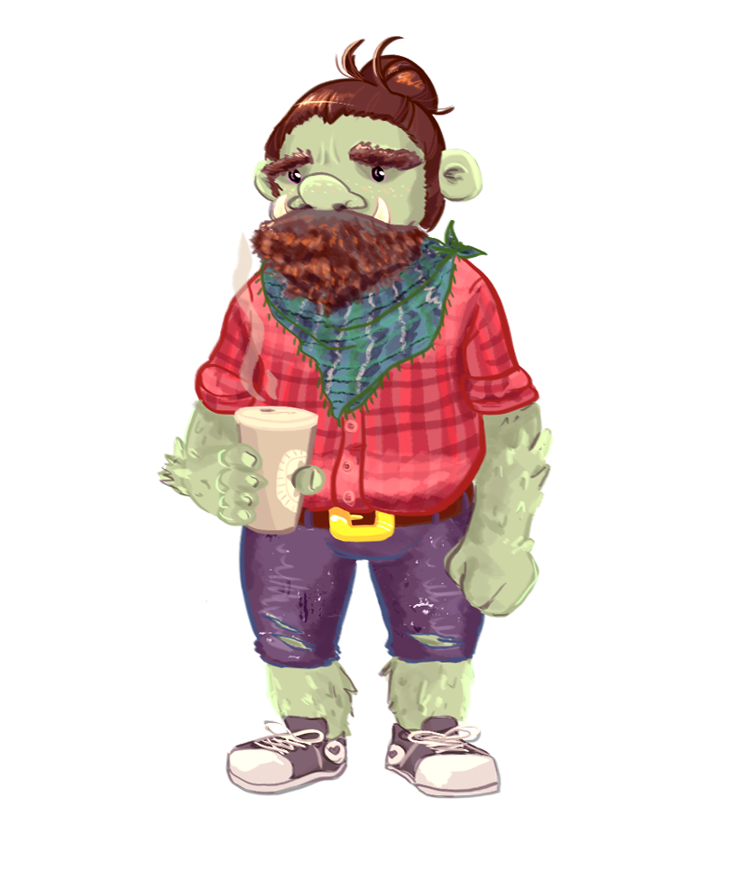

# SteganOgre.js

**Front-end** library for storing messages inside image data.

## why do it in the browser?
- no dependency on any software other than the browser
- no dependency on 3rd party service
